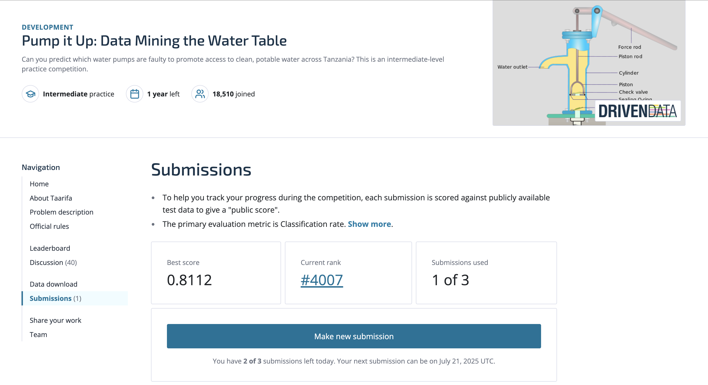

# Water Pump Status Prediction - Tanzania

[](https://tanzania-water-pump-predictor.streamlit.app)
[](https://opensource.org/licenses/MIT)
[](https://www.python.org/downloads/)

This repository contains a machine learning solution for predicting the operational status of water pumps in Tanzania. The project was developed as part of the DrivenData competition "Pump it Up: Data Mining the Water Table".

## 🚀 Live Demo

**[Try the Interactive Demo](https://tanzania-water-pump-predictor.streamlit.app)** - Predict water pump status with an interactive web application!

## 🏆 Competition Information

**Competition**: [Pump it Up: Data Mining the Water Table](https://www.drivendata.org/competitions/7/pump-it-up-data-mining-the-water-table/)  
**Host**: DrivenData  
**Goal**: Predict which water pumps are functional, which need repairs, and which don't work at all

## 📊 Project Overview

Using data from Taarifa and the Tanzanian Ministry of Water, this solution predicts the operating condition of water points across Tanzania. The model helps improve maintenance operations and ensure clean, potable water access for communities.

### Problem Statement
- **Task**: Multi-class classification (3 classes)
- **Classes**: 
  - `functional` (54.3%)
  - `non functional` (38.4%)
  - `functional needs repair` (7.3%)
- **Dataset Size**: 59,400 training samples, 14,850 test samples

### Key Achievements
- **Validation Accuracy**: 80.48%
- **Leaderboard Score**: 0.8112 (Rank #4007 as of July 21, 2025)
- **Approach**: Optimized Random Forest with extensive feature engineering
- **Key Insights**: Water quantity is the strongest predictor of pump functionality

### 📈 Competition Leaderboard

*Current leaderboard position as of July 21, 2025 at 7:30 AEST*

## 🚀 Getting Started

### Prerequisites
```bash
python>=3.8
```

### Installation
1. Clone the repository:
```bash
git clone https://github.com/yourusername/water-pump-prediction-tanzania.git
cd water-pump-prediction-tanzania
```

2. Install dependencies:
```bash
pip install -r requirements.txt
```

3. Download the competition data from [DrivenData](https://www.drivendata.org/competitions/7/pump-it-up-data-mining-the-water-table/data/) and place in the project directory.

### Usage
1. Run exploratory data analysis:
```bash
python eda_analysis.py
```

2. Generate visualizations:
```bash
python visualizations.py
```

3. Train the baseline model:
```bash
python water_pump_model.py
```

4. Train the optimized model:
```bash
python model_optimization_final.py
```

### Running the Demo Locally

1. Install Streamlit dependencies:
```bash
pip install -r requirements_streamlit.txt
```

2. Run the Streamlit app:
```bash
streamlit run streamlit_app.py
```

3. Open your browser to `http://localhost:8501`

## 📁 Project Structure
```
water-pump-prediction-tanzania/
├── eda_analysis.py                 # Detailed exploratory data analysis
├── visualizations.py               # Data visualization script
├── water_pump_analysis.py          # Initial data exploration
├── water_pump_model.py             # Baseline model with feature engineering
├── model_optimization_final.py     # Optimized Random Forest model
├── pump_analysis_visualizations.png # EDA visualizations
├── requirements.txt                # Python dependencies
├── LICENSE                         # MIT License
├── README.md                       # This file
├── streamlit_app.py               # Interactive web demo
├── requirements_streamlit.txt     # Streamlit app dependencies
├── train_demo_model.py           # Demo model trainer
├── demo_model.pkl                # Lightweight model for demo
└── features_info.pkl             # Feature information
```

## 🔍 Key Features Engineered

1. **Water Availability Features**:
   - Binary indicators for dry pumps (97% non-functional)
   - Water sufficiency scores

2. **Geographic Features**:
   - GPS availability and precision
   - Log-transformed GPS height
   - Distance calculations

3. **Temporal Features**:
   - Pump age calculations
   - Construction year groupings

4. **Payment & Management Features**:
   - Payment reliability scores
   - Management quality indicators

## 📈 Model Performance

The optimized Random Forest model achieved:
- **Validation Accuracy**: 80.48%
- **Cross-validation Score**: 79.71% (±0.65%)

### Top Important Features:
1. Longitude/Latitude (geographic location)
2. Water quantity indicators
3. GPS height
4. Administrative regions (ward, LGA)
5. Pump age and construction year

## 🙏 Acknowledgments

- **Data Source**: This project uses data provided by [Taarifa](http://taarifa.org/) and the Tanzanian Ministry of Water
- **Competition Host**: [DrivenData](https://www.drivendata.org/) for organizing this competition
- **Purpose**: This competition helps improve water access for communities in Tanzania

## 📄 License

This project is licensed under the MIT License - see the [LICENSE](LICENSE) file for details.

## ⚠️ Disclaimer

This solution is for educational and competition purposes. The actual deployment of such models should involve collaboration with domain experts and local stakeholders.

## 🤝 Contributing

Contributions are welcome! Please feel free to submit a Pull Request.

---

**Note**: Competition data files are not included in this repository. Please download them from the [competition page](https://www.drivendata.org/competitions/7/pump-it-up-data-mining-the-water-table/data/).